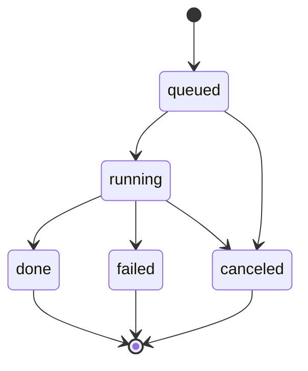

# Backend Handoff Pack (UI + RAG)

## Source of truth
- API contract: `docs/openapi.v1.yaml`
- UI token-session contract: `docs/openapi.github-session.v1.yaml`
- SQL schema: `db/migrations/0001_init.sql`
- ERD: `docs/erd.mmd`
- Working examples: `docs/examples/*`

## Job state machine

Rules:
1. `POST /prs/{prId}/analysis-jobs` creates job in `queued` then worker moves to `running`.
2. Terminal states: `done | failed | canceled`.
3. `POST /analysis-jobs/{jobId}/cancel` is idempotent; terminal state remains unchanged.
4. Partial RAG failures do not fail the whole job by default; job can be `done` with `summary.partialFailures > 0`.

## Idempotency rules
1. PR sync idempotency: if latest snapshot `headSha` equals incoming `headSha`, backend returns existing snapshot and `idempotent=true`.
2. Publish idempotency: unique key `(prId, jobId, mode)`; repeated `POST /prs/{prId}/publish` returns prior result and does not duplicate comments.
3. Feedback upsert idempotency: unique `(commentId, userId)` with `PUT /comments/{commentId}/feedback`.

## Pagination contract
1. Cursor-based pagination for list endpoints.
2. Query params: `cursor` and `limit`.
3. Defaults: `limit=50`, max `200`.
4. Response shape: `{ items: [...], nextCursor: string|null, limit: number }`.

## Limits (MVP defaults)
1. Max files per sync: `500`.
2. Patch size cap per file: `300KB`.
3. Oversized files: `isTooLarge=true`, diff payload may be omitted.
4. Job timeout target: `15m` (runtime policy for worker).
5. Retry target: `3` attempts with exponential backoff.

## Internal RAG contract

Request (backend -> RAG):
- `jobId`, `snapshotId`, `scope[]`
- `files[]`: `{ path, language, patch, hunks?, lineMap? }`
- `limits`: `{ maxComments, maxPerFile }`

Response (RAG -> backend):
- `suggestions[]` in backend `Suggestion` shape
- `citations[]` per suggestion
- optional `fingerprint` (backend computes fallback if omitted)
- `partialFailures` integer

## Adaptation v1
1. Backend computes historical feedback score by suggestion fingerprint.
2. Result ordering in `GET /analysis-jobs/{jobId}/results` uses:
   - higher feedback score first
   - then higher severity
   - then creation time
3. No model fine-tuning in MVP.

## UI PAT Session Flow (Demo Mode)
1. `POST /github/session` with GitHub PAT.
2. `GET /github/session/{sessionId}/repos` to list repositories and backend `repoId` mapping.
3. `GET /github/session/{sessionId}/repos/{owner}/{repo}/prs` to list pull requests.
4. `POST /github/session/{sessionId}/repos/{owner}/{repo}/prs/{prNumber}/sync` to ingest selected PR.
5. Continue normal backend flow: analysis -> results -> publish -> feedback.

Security note:
- This PAT flow is for internal demo/MVP UX only.
- Production target remains GitHub App/OAuth.
